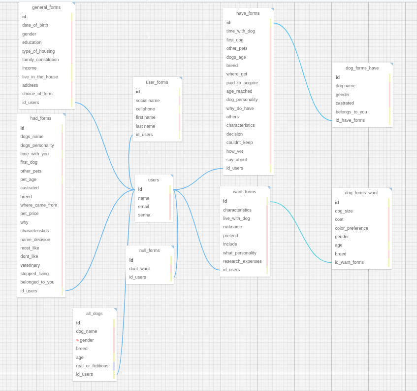

# Documentação do Modelo Relacional e Físico - Projeto Abandono Zero

**Projeto:** Abandono Zero

**Data:** 12/05/2024

**Autor:** Arthur Bretas Oliveira

**Objetivo:** Este documento oferece uma visão detalhada da arquitetura do banco de dados para o projeto Abandono Zero, que tem como meta principal a organização eficiente dos dados de usuários e as informações relacionadas aos formulários preenchidos por eles, assim como os registros sobre cachorros atuais, passados e futuros desejos de posse. A modelagem detalha todas as entidades envolvidas, especificando seus atributos e as interconexões existentes, o que proporciona um entendimento limpo e sistemático de como os dados são gerenciados e armazenados.

## Entidades

### users
- **Descrição**: Armazena informações sobre os usuários e se relaciona com as outras entidades.
- **Chave Primária**: id
- **Atributos**:
    - **id**: `INTEGER` (Chave primária, identificador único)
    - **name**: `VARCHAR(50)` (Nome do usuário)
    - **email**: `VARCHAR(50)` (Email do usuário)

### general_forms
- **Descrição**: Armazena detalhes gerais sobre o usuário, incluindo informações demográficas e socioeconômicas.
- **Chave Primária**: id
- **Chave Estrangeira**: `id_users` referenciando `users.id` `(UNIQUE)`.
- **Atributos**:
    - **id**: `INTEGER` (Chave primária, identificador único)
    - **age**: `INTEGER` (Idade do usuário)
    - **gender**: `VARCHAR(10)` (Gênero do usuário)
    - **education**: `VARCHAR(50)` (Escolaridade do usuário)
    - **type_of_housing**: `VARCHAR(50)` (Tipo de moradia do usuário)
    - **family_constitution**: `VARCHAR(100)` (Constituição familiar)
    - **income**: `DECIMAL(10,2)` (Renda familiar mensal)
    - **live_in_the_house**: `INTEGER` (Quantidade de pessoas que moram na casa)
    - **address**: `VARCHAR(255)` (Endereço do usuário)
    - **choice_of_form**: `VARCHAR(50)` (Escolha de qual formulário o usuário vai responder)

### have_forms
- **Descrição**: Armazena detalhes sobre o cão mais recente que o usuário possui.
- **Chave Primária**: `id`
- **Chave Estrangeira**: `id_users` referenciando `users.id`.
- **Atributos**:
    - **id**: `INTEGER` (Chave primária, identificador único)
    - **time_with_dog**: `INTEGER` (Tempo que o usuário passa com o cão)
    - **first_dog**: `TEXT` (Informações sobre o primeiro cão do usuário)
    - **other_pets**: `TEXT` (Informações sobre outros pets do usuário)
    - **dogs_age**: `INTEGER` (Idade do cão)
    - **breed**: `VARCHAR(50)` (Raça do cão)
    - **where_get**: `VARCHAR(100)` (De onde o usuário obteve o cão)
    - **paid_to_acquire**: `BOOLEAN` (Se o usuário pagou pelo cão)
    - **age_reached**: `INTEGER` (Idade em que o cão atingiu certos marcos)
    - **dog_personality**: `TEXT` (Personalidade do cão)
    - **why_do_have**: `TEXT` (Por que o usuário tem o cão)
    - **others**: `TEXT` (Outras informações relevantes)
    - **characteristics**: `TEXT` (Características físicas do cão)
    - **decision**: `TEXT` (Decisões tomadas sobre o cão)
    - **couldnt_keep**: `BOOLEAN` (Se o usuário não conseguiu manter o cão)
    - **how_vet**: `TEXT` (Como o cão foi tratado veterinariamente)
    - **say_about**: `TEXT` (O que o usuário diz sobre o cão)

### had_forms
- **Descrição**: Armazena detalhes sobre o cão mais recente que o usuário já teve ou conviveu.
- **Chave Primária**: `id`
- **Chave Estrangeira**: `id_users` referenciando `users.id`.
- **Atributos**:
    - **id**: `INTEGER` (Chave primária, identificador único)
    - **dogs_name**: `VARCHAR(50)` (Nome do cão)
    - **dogs_personality**: `TEXT` (Personalidade do cão)
    - **time_with_you**: `INTEGER` (Tempo que o usuário passou com o cão)
    - **first_dog**: `TEXT` (Informações sobre o primeiro cão do usuário)
    - **other_pets**: `TEXT` (Informações sobre outros pets do usuário)
    - **pet_age**: `INTEGER` (Idade do cão)
    - **castrated**: `BOOLEAN` (Se o cão foi castrado)
    - **breed**: `VARCHAR(50)` (Raça do cão)
    - **where_came_from**: `VARCHAR(100)` (De onde o cão veio)
    - **pet_price**: `DECIMAL(10,2)` (Preço pago pelo cão)
    - **why**: `TEXT` (Por que o usuário teve o cão)
    - **characteristics**: `TEXT` (Características físicas do cão)
    - **name_decision**: `TEXT` (Decisão sobre o nome do cão)
    - **most_like**: `TEXT` (Coisas que o usuário mais gosta do cão)
    - **dont_like**: `TEXT` (Coisas que o usuário não gosta do cão)
    - **veterinary**: `TEXT` (Informações sobre tratamento veterinário)
    - **stopped_living**: `BOOLEAN` (Se o cão parou de viver)
    - **belonged_to_you**: `BOOLEAN` (Se o cão pertencia ao usuário)

### want_forms
- **Descrição**: Armazena informações do usuário que quer ter um cão no futuro.
- **Chave Primária**: `id`
- **Chave Estrangeira**: `id_users` referenciando `users.id`.
- **Atributos**:
    - **id**: `INTEGER` (Chave primária, identificador único)
    - **live_with_dog**: `TEXT` (Por que o usuário gostaria de conviver com um cão)
    - **nickname**: `VARCHAR(50)` (Possível nome do cão)
    - **pretend**: `BOOLEAN` (Se o usuário pretende comprar ou adotar)
    - **include**: `DATE` (Quando o usuário planeja incluir o cão em sua casa)
    - **what_personality**: `TEXT` (Personalidade que o usuário quer no cão)
    - **research_expenses**: `DECIMAL(10,2)` (Pesquisa sobre despesas mensais com o pet)

### null_forms
- **Descrição**: Armazena dados do usuário que nunca conviveu ou teve cães e não tem vontade de ter.
- **Chave Primária**: `id`
- **Chave Estrangeira**: `id_users` referenciando `users.id`.
- **Atributos**:
    - **id**: `INTEGER` (Chave primária, identificador único)
    - **dont_want**: `TEXT` (Por que o usuário não quer ter cães)

### user_forms
- **Descrição**: Entidade específica relacionada tanto com a entidade have_forms quanto com a want_forms para salvar o contato do usuário para futuras pesquisas.
- **Observação:** Essa entidade só vai receber uma foreign key, vai depender da escolha do usuário na hora do preenchimento do formulário.
- **Chave Estrangeira**: `id_users` referenciando `users.id` `(UNIQUE)`.
- **Atributos**:
    - **id**: `INTEGER` (Chave primária, identificador único)
    - **first_name**: `VARCHAR(50)` (Primeiro nome do usuário)
    - **last_name**: `VARCHAR(50)` (Sobrenome do usuário)
    - **social_name**: `VARCHAR(50)` (Nome social do usuário)
    - **cellphone**: `VARCHAR(15)` (Celular do usuário para futuros contatos)
    - **email**: `VARCHAR(50)` (E-mail do usuário para futuros contatos)

### dog_forms_have
- **Descrição**: Entidade específica relacionada com a entidade have_forms para salvar informações extras do cão.
- **Chaves Estrangeiras**:
  - **id_have_forms** referenciando `have_forms.id`.
- **Atributos**:
    - **id**: `INTEGER` (Chave primária, identificador único)
    - **dog_name**: `VARCHAR(50)` (Nome do cão)
    - **gender**: `VARCHAR(10)` (Gênero do cão)
    - **castrated**: `BOOLEAN` (Se o cão é castrado)
    - **belongs_to_you**: `BOOLEAN` (Se o cão pertence ao usuário)

### dog_forms_want
- **Descrição**: Entidade específica relacionada com a entidade want_forms para salvar informações extras do cão.
- **Chaves Estrangeiras**:
  - **id_want_forms** referenciando `want_forms.id`.
- **Atributos**:
    - **dog_size**: `VARCHAR(20)` (Tamanho do cão)
    - **coat**: `VARCHAR(50)` (Tipo da pelagem do cão)
    - **color_preference**: `VARCHAR(50)` (Cor preferida do cão)
    - **gender**: `VARCHAR(10)` (Gênero do cão)
    - **age**: `INTEGER` (Idade do cão)
    - **breed**: `VARCHAR(50)` (Raça do cão)

## Relacionamentos

&nbsp;&nbsp;&nbsp;&nbsp;&nbsp;&nbsp;A compreensão dos vínculos entre as entidades é crucial para entender como os dados são interconectados e a maneira pela qual as operações de CRUD (Criar, Ler, Atualizar, Deletar) impactam estas entidades. Aqui estão detalhados os relacionamentos entre as entidades:

- **users**:
  - **general_forms**: Cada usuário está vinculado a um único formulário geral (`1:1`). A chave estrangeira `id_users` na tabela `general_forms` é única, refletindo essa relação.
  - **have_forms**: Um usuário pode possuir diversos formulários dos cães que atualmente tem (`1:N`).
  - **had_forms**: Um usuário pode ter históricos de múltiplos cães que já possuíram (`1:N`).
  - **want_forms**: Um usuário pode expressar interesse em múltiplos cães que deseja adotar no futuro (`1:N`).
  - **null_forms**: Um usuário pode registrar múltiplos formulários indicando a falta de interesse ou experiência em ter cães (`1:N`).
  - **user_forms**: Cada usuário está associado a um único formulário de contato específico (`1:1`). A chave estrangeira `id_users` na tabela `user_forms` é única para essa relação.

- **all_dogs**:
  - **users**: Cada entrada na tabela `all_dogs` está diretamente relacionada a um usuário através da chave estrangeira `id_users`, conectando cada cão, real ou fictício, ao seu usuário correspondente (`1:N`).

- **general_forms**:
  - Diretamente vinculado a `users` por meio da chave estrangeira `id_users`.

- **have_forms**:
  - Diretamente vinculado a `users` por meio da chave estrangeira `id_users`.
  - Associado a `user_forms` por meio da chave estrangeira `id_have_forms`.
  - Conectado a `dog_forms_have` através da chave estrangeira `id_have_forms`.

- **had_forms**:
  - Diretamente vinculado a `users` através da chave estrangeira `id_users`.

- **want_forms**:
  - Diretamente vinculado a `users` através da chave estrangeira `id_users`.
  - Conectado a `user_forms` por meio da chave estrangeira `id_want_forms`.
  - Associado a `dog_forms_want` através da chave estrangeira `id_want_forms`.

- **null_forms**:
  - Diretamente vinculado a `users` através da chave estrangeira `id_users`.

- **user_forms**:
  - Diretamente vinculado a `users` através da chave estrangeira `id_users`.

- **dog_forms_have**:
  - Associado a `have_forms` através da chave estrangeira `id_have_forms`.

- **dog_forms_want**:
  - Associado a `want_forms` através da chave estrangeira `id_want_forms`.

## Regras de Negócio

&nbsp;&nbsp;&nbsp;&nbsp;&nbsp;&nbsp;As regras de negócio são essenciais para manter a integridade e a lógica operacional do sistema. Elas orientam as interações dentro do projeto Abandono Zero, garantindo que os processos sejam executados corretamente. Abaixo estão as principais regras de negócio definidas para o projeto:

### 1. Preenchimento Obrigatório

&nbsp;&nbsp;&nbsp;&nbsp;&nbsp;&nbsp;É imperativo que todos os campos designados como obrigatórios nos formulários sejam completamente preenchidos antes que o usuário possa efetuar a submissão do formulário.

### 2. Uniformidade das Informações

&nbsp;&nbsp;&nbsp;&nbsp;&nbsp;&nbsp;A consistência das informações é crucial. Os dados fornecidos pelos usuários devem permanecer uniformes em diferentes formulários. Por exemplo, detalhes como o nome do cão devem ser consistentes em todas as instâncias documentadas.

### 3. Limitações na Alteração de Dados

&nbsp;&nbsp;&nbsp;&nbsp;&nbsp;&nbsp;Após a submissão inicial de um formulário, as informações registradas não podem ser alteradas pelo usuário, salvo em situações excepcionais com autorização explícita da gestão.

### 4. Proteção de Dados Pessoais

&nbsp;&nbsp;&nbsp;&nbsp;&nbsp;&nbsp;A privacidade dos dados pessoais dos usuários é rigorosamente protegida. Acesso a essas informações está restrito exclusivamente a funcionários com autorização.

### 5. Singularidade dos Dados

&nbsp;&nbsp;&nbsp;&nbsp;&nbsp;&nbsp;Cada campo nos formulários deve ser único e preenchido adequadamente pelo usuário, assegurando que não haja duplicidade ou omissão de dados.

### 6. Flexibilidade na Atualização de Dados

&nbsp;&nbsp;&nbsp;&nbsp;&nbsp;&nbsp;Os usuários têm a liberdade de atualizar suas informações pessoais presentes no formulário geral sempre que necessário, garantindo que o banco de dados reflita as informações mais atuais.

## Diagrama

## Conclusão

&nbsp;&nbsp;&nbsp;&nbsp;&nbsp;&nbsp;Esta estrutura de banco de dados foi meticulosamente projetada para atender às demandas específicas do projeto Abandono Zero, facilitando a administração precisa dos dados dos usuários e as informações coletadas por meio dos formulários. A modelagem detalha cada entidade, seus atributos e como elas estão interligadas, oferecendo uma perspectiva organizada e transparente do sistema de dados. A inclusão da tabela all_dogs enriquece o gerenciamento dos dados ao integrar informações tanto de cachorros atuais quanto de intenções futuras dos usuários, assegurando tanto a integridade quanto a precisão das informações armazenadas.
